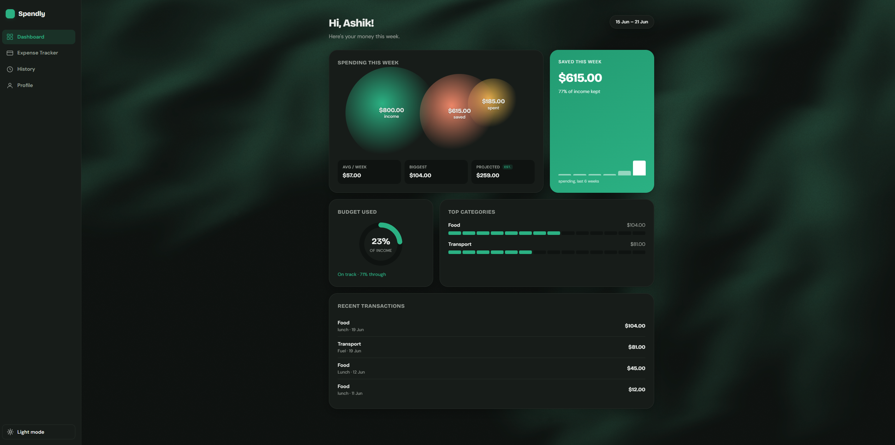

# Spendly

A full-stack personal expense tracker built around **spending periods**. Log expenses by week, fortnight, or month; set your income for each period; and see how much you actually kept. When a new period begins, the current view starts fresh while every past period stays browsable — nothing is ever reset or lost.

Built with React, Express, and MySQL.

<!-- Add a live link here once deployed -->
**Live demo:** _coming soon_

<!-- Replace with a real screenshot/GIF once you have one -->


---

## Features

- **Period-based tracking** — view spending by week, fortnight, or month. Periods are computed from dates, so switching the view re-buckets the same data; a new period simply begins on the calendar with no manual reset.
- **Full expense management** — add, edit (inline), and delete expenses, with a confirmation step before anything is removed. Backdate an expense to any day.
- **Income & savings** — set income per period and see income vs. spent vs. saved, including your savings rate.
- **Dashboard** — an at-a-glance overview: a spending-vs-income visualization, a 6-period spending trend, budget-usage gauge, spending pace, a projected end-of-period total, top categories, and recent transactions.
- **History** — browse every past period and expand any one to see its category breakdown and full transaction list.
- **Profile / settings** — name, default period, and currency, all persisted to the database; plus a danger zone to clear all data.
- **Light & dark themes** — a theme toggle with an animated WebGL background, persisted across sessions.

---

## Tech stack

| Layer | Technology |
| --- | --- |
| Frontend | React (Vite), React Router, React Context |
| Backend | Node.js, Express |
| Database | MySQL (`mysql2`) |
| Styling | Plain CSS with custom properties (CSS variables) for theming |
| Visuals | Three.js (animated background), hand-built SVG charts |
| Config | dotenv, CORS |

No charting or component library — the donut chart, trend bars, and radial gauge are built directly with SVG and CSS.

---

## Project structure

```
spendly/
├── server/                 # Express API
│   ├── index.js            # routes
│   ├── db.js               # MySQL connection pool
│   └── .env                # DB credentials (not committed)
└── client/                 # React app (Vite)
    └── src/
        ├── App.jsx             # app shell: sidebar, routing, theme
        ├── SettingsContext.jsx # app-wide settings via Context
        ├── periods.js          # pure date logic (the "period engine")
        ├── pages/              # Dashboard, ExpenseTracker, History, Profile
        └── components/         # background visuals
```

---

## API

| Method | Endpoint | Purpose |
| --- | --- | --- |
| GET | `/api/expenses` | List all expenses |
| POST | `/api/expenses` | Add an expense (date optional) |
| PUT | `/api/expenses/:id` | Update an expense |
| DELETE | `/api/expenses/:id` | Delete an expense |
| GET | `/api/summary` | Spending grouped by category (`GROUP BY`) |
| GET | `/api/income` | List income records |
| POST | `/api/income` | Set/update income for a period (upsert) |
| GET | `/api/settings` | Read app settings |
| PUT | `/api/settings` | Update app settings (upsert) |
| POST | `/api/reset` | Clear all expenses and income |

---

## Database schema

Three tables: `expenses`, `income` (one record per period, enforced by a unique key), and a single-row `settings` table.

```sql
CREATE TABLE expenses (
  id INT AUTO_INCREMENT PRIMARY KEY,
  amount DECIMAL(10, 2) NOT NULL,
  category VARCHAR(50) NOT NULL,
  description VARCHAR(255),
  date_added DATETIME DEFAULT CURRENT_TIMESTAMP
);

CREATE TABLE income (
  id INT AUTO_INCREMENT PRIMARY KEY,
  period_type VARCHAR(20) NOT NULL,
  period_start DATE NOT NULL,
  amount DECIMAL(10, 2) NOT NULL,
  UNIQUE KEY uniq_period (period_type, period_start)
);

CREATE TABLE settings (
  id INT PRIMARY KEY,
  name VARCHAR(100) DEFAULT '',
  default_period VARCHAR(20) DEFAULT 'weekly',
  currency VARCHAR(8) DEFAULT 'AUD'
);
```

---

## Running locally

**Prerequisites:** Node.js, MySQL.

**1. Database**

Create the database and tables (see the schema above) in MySQL — for example via MySQL Workbench.

**2. Backend**

```bash
cd server
npm install
```

Create `server/.env`:

```
DB_HOST=localhost
DB_USER=root
DB_PASSWORD=your_mysql_password
DB_NAME=expense_tracker
PORT=5000
```

Then start it:

```bash
node index.js
```

**3. Frontend**

```bash
cd client
npm install
npm run dev
```

Open the URL Vite prints (e.g. `http://localhost:5173`).

---

## Engineering decisions

A few choices worth calling out:

- **A pure "period engine."** All date logic — which week/fortnight/month a date belongs to, navigating between periods — lives in `periods.js` as plain functions with no React. The UI derives everything from two values (period type + a reference date), so changing either recalculates the whole view. Keeping the domain logic separate from the components makes it simple to reason about and reuse across every page.
- **Derived state over stored state.** Totals, savings, category breakdowns, sorting, and the dashboard analytics are all computed from the raw expense/income data on each render rather than stored separately — there's a single source of truth and nothing to keep in sync.
- **`DECIMAL` for money.** Monetary columns use `DECIMAL(10,2)` rather than `FLOAT`, so amounts stay exact instead of accumulating floating-point rounding error.
- **Parameterized queries.** Every SQL query uses placeholders with a separate values array, which prevents SQL injection.
- **Upserts for income and settings.** `INSERT ... ON DUPLICATE KEY UPDATE` lets a single endpoint both create and update a record, instead of checking existence first.
- **Theme persistence split.** The theme is stored in `localStorage` (synchronous, so it applies before first paint and avoids a flash of the wrong theme), while other settings live in MySQL. Choosing the right storage for each kind of data matters.
- **React Context for app-wide settings.** Settings are shared through a `SettingsProvider` so any page can read or update them without prop-drilling.

---

## Author

**MD Ashik Mahmud**

- Portfolio: [ash-nu.vercel.app](https://ash-nu.vercel.app/)
- GitHub: [@ashnrb](https://github.com/ashnrb)
- LinkedIn: [in/ashnrb](https://www.linkedin.com/in/ashnrb/)
